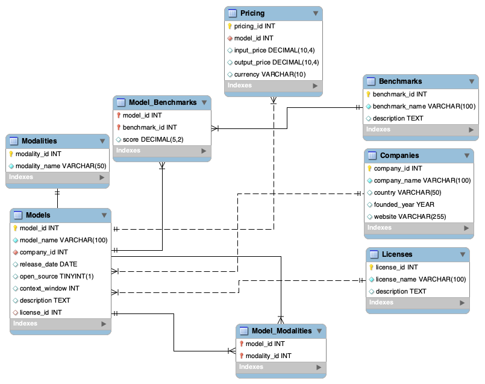

# 🤖 AI Model Hub

A relational SQL database for comparing modern AI models.

GPT-5, Claude, Gemini, Grok...

Every few months, a new AI model is released, claiming to be faster, smarter, or more capable than the last.

But once the hype fades, one question remains.

> **How do we actually compare them?**

This project answers that question by organizing AI model data into a relational SQL database.

Instead of searching across multiple websites, everything is structured in one place—from companies and models to pricing, licenses, supported modalities, and benchmark performance.

---

## 🖼️ Project Preview

---

## 📖 Why I Built This Project

AI models are evolving rapidly, with new releases appearing every few months. While exploring them, I noticed that comparing information across different websites was often confusing and unstructured.

I built this project to organize that information into a relational SQL database, making it easier to compare AI models based on their companies, pricing, licenses, supported modalities, and benchmark performance.

This project also gave me the opportunity to practice database design, table relationships, and writing meaningful SQL queries using a real-world topic that genuinely interests me.

---

## 🗄 Database Design

The database contains eight related tables connected through primary and foreign keys to organize AI model information efficiently.

---

## 📋 Database Tables

| Table | Purpose |
|-------|---------|
| Companies | Stores AI companies |
| Models | Stores AI models |
| Licenses | Stores license types |
| Modalities | Stores supported modalities |
| Benchmarks | Stores benchmark names |
| Model_Modalities | Links models to modalities |
| Model_Benchmarks | Stores benchmark scores |
| Pricing | Stores model pricing |

---

## 📚 What I Learned

- Designing a relational database.
- Building relationships using primary and foreign keys.
- Writing SQL queries using JOIN, GROUP BY, and aggregate functions.
- Organizing real-world AI model data into a structured database.

---

## 🛠️ Built With

- MySQL Database
- MySQL Workbench

---

## 👩‍💻 Author

**Retaj Aljuaid**

- GitHub: https://github.com/RetajAljuaid
- LinkedIn: https://www.linkedin.com/in/retaj-aljuaid-ba80a437a